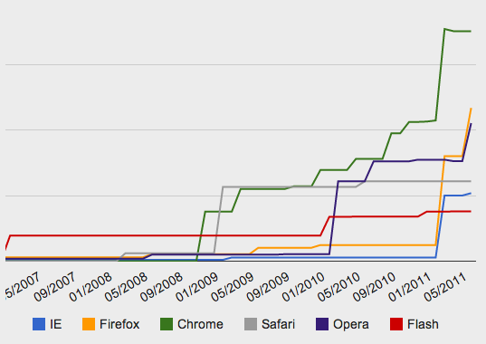

!SLIDE

# JavaScript

## the little language everyone loves to hate

### [@aidanfeldman](https://twitter.com/aidanfeldman)

!SLIDE

# moi

* [Education Hacker](https://github.com/blog/1617-aidan-feldman-is-a-githubber), [GitHub](https://github.com)
* Instructor, [NYU](http://scps.nyu.edu/)
* Organizer, [Hacker Hours](http://hackerhours.org)
* Author, *[Developing a Backbone.js Edge](http://www.amazon.com/Developing-a-Backbone-js-Edge-ebook/dp/B00CBP7N3O)*

!SLIDE

# The Highlights

* interpreted, scripting language
* weakly (bad-duck) typed
* single-threaded
* first-class functions
* prototypal inheritance

!SLIDE

# The History

* designed in a week by Brendan Eich for Netscape
* inspired by Self and Scheme, *not* Java
* server-side since 1994, popularized by Node.js
* "JavaScript" trademark owned by Sun, so formal name is "ECMAScript"

!SLIDE

# The Browser Wars

* started in late 90's as IE replaced Netscape
* huge leaps in JS VM speed

!SLIDE

[iq12.com/old_blog/as3-benchmark/](http://iq12.com/old_blog/as3-benchmark/)

!SLIDE

# Types

* primitives (pass by value)
    * string
    * boolean
    * number
* objects (pass by reference)
    * objects
    * arrays
    * functions

!SLIDE

# Numbers

* the only numeric datatype
* floating point!

.notes this is why it's not "hardcore"

!SLIDE

# Functions

* first-class

!SLIDE

# Scope

Functional, not block-level (C-style)

!SLIDE

# Context

.notes maybe this is too detailed?

!SLIDE

# Closures

.notes show binding of context?

!SLIDE

# Fake OOP

* prototypes
* extending objects

!SLIDE

# Namespacing

nope.

!SLIDE

# Transpiling

* CoffeeScript
* Typescript

!SLIDE

# Coming Up

!SLIDE

# Coming Up

## asm.js

https://blog.mozilla.org/blog/2013/03/27/mozilla-is-unlocking-the-power-of-the-web-as-a-platform-for-gaming/

!SLIDE

# Coming Up

## ES6

* Object.observe
* modules
* getters and setters
* generators

!SLIDE

# Frameworks

!SLIDE

# Frameworks

## Basic MVC

* Backbone
* Spine

!SLIDE

# Frameworks

## Data Binding

* Angular
* Ember

!SLIDE

# Frameworks

## UI

* Sproutcore
* jQuery UI
* jQuery Mobile
* Bootstrap

!SLIDE

# See Also

* http://www.youtube.com/watch?v=hQVTIJBZook
* asm.js
  * https://blog.mozilla.org/blog/2013/03/27/mozilla-is-unlocking-the-power-of-the-web-as-a-platform-for-gaming/
  * http://ejohn.org/blog/asmjs-javascript-compile-target/
* performance history
    * http://blog.chromium.org/2010/12/new-crankshaft-for-v8.html
    * http://iq12.com/old_blog/as3-benchmark/s
* https://docs.google.com/presentation/d/1Gv-dvU-yy6WY7SiNJ9QRo9XayPS6N2jtgWezdRpoI04/edit#slide=id.p
* https://github.com/afeld/advanced_js#resources

!SLIDE

# Fin.

Aidan Feldman

[@aidanfeldman](https://twitter.com/aidanfeldman)

[api.afeld.me](http://api.afeld.me)
